# 📦 商品レビューWebアプリ

---

## 💡 開発の目的

- Javaの開発環境に触れるため
- Webアプリ開発の基礎技術を学ぶため
- 権限管理や画面遷移の実装を体験するため

---

## ⚙️ 機能概要

- ユーザー登録・ログイン機能
- 商品一覧表示
  - 商品情報の表示
  - 平均レビュー点数表示
- 商品詳細表示
  - 商品レビュー一覧
  - ログイン済みユーザーによるレビュー投稿
- 管理者機能
  - 商品登録
  - 商品削除
- 権限ごとに画面表示を切り替え
- Bootstrapによるレスポンシブ対応UI

---

## 🗺️ 全体の遷移概要

以下は、ユーザー権限ごとの大まかな画面遷移イメージです。
　-　👥 一般ユーザー（ログイン済）
	- 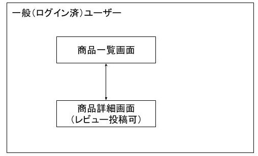
　-　🔐 管理者
	- 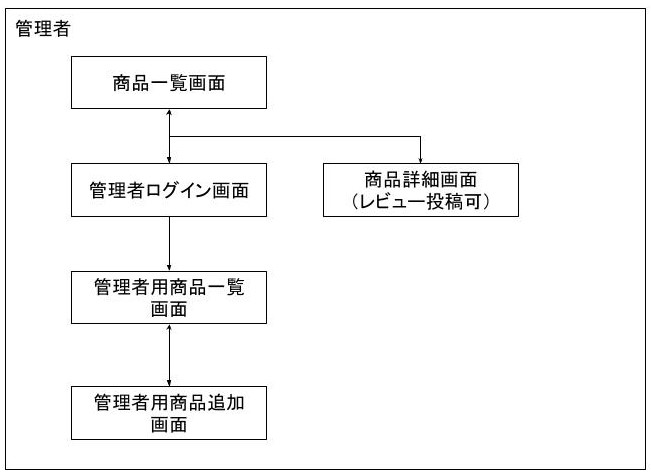
　-　🚪 未ログインユーザー
	- 

## 🖼️ 権限ごとの画面キャプチャ

### 🔒 管理者用画面

#### 管理者ログイン画面

- 管理者用のログインページ
- 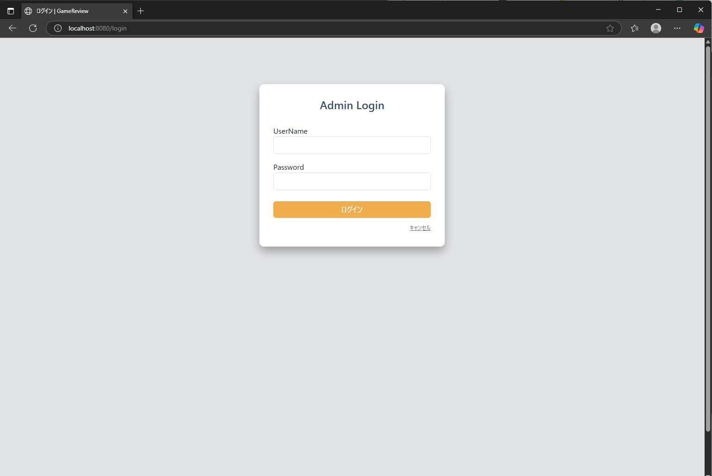

#### 管理者用 商品一覧画面

- 管理者用の商品一覧画面
- 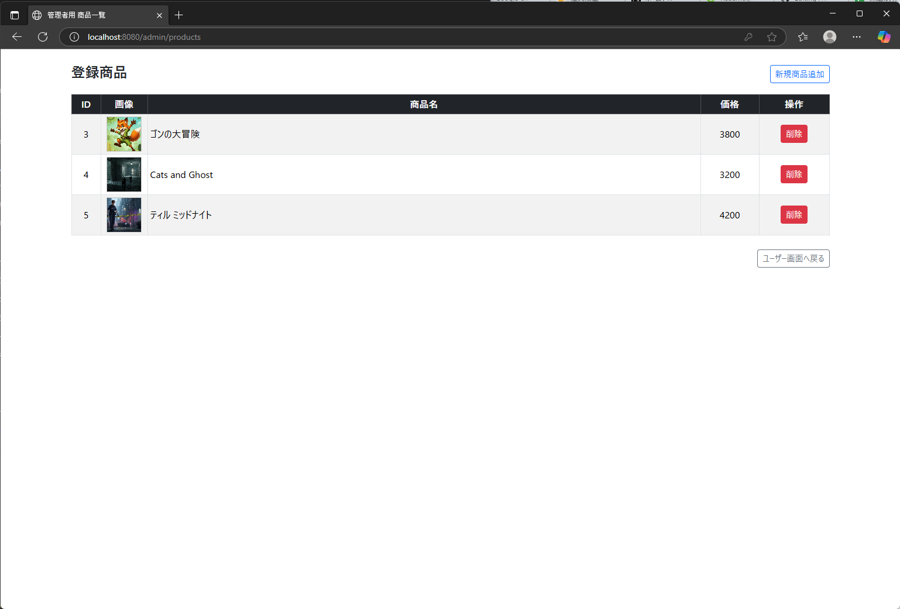

#### 管理者用 商品登録画面
- 商品情報を新規登録
- 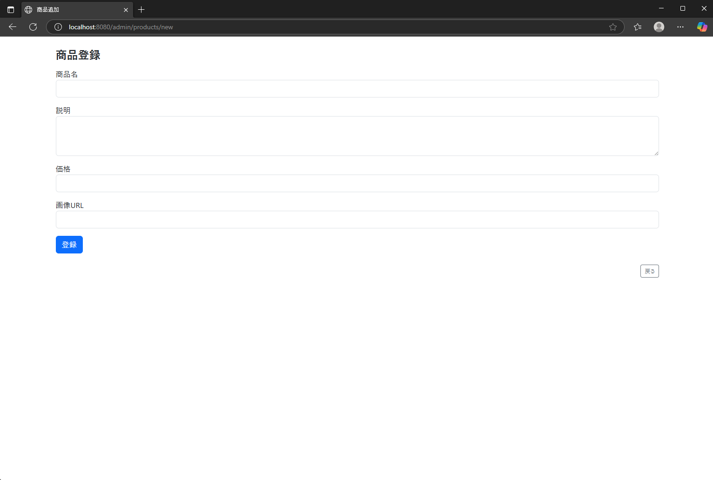

---

### 👤 一般ユーザー（ログイン済）

#### 商品一覧画面

- 右上にユーザー名表示
- ログアウトボタン表示
- 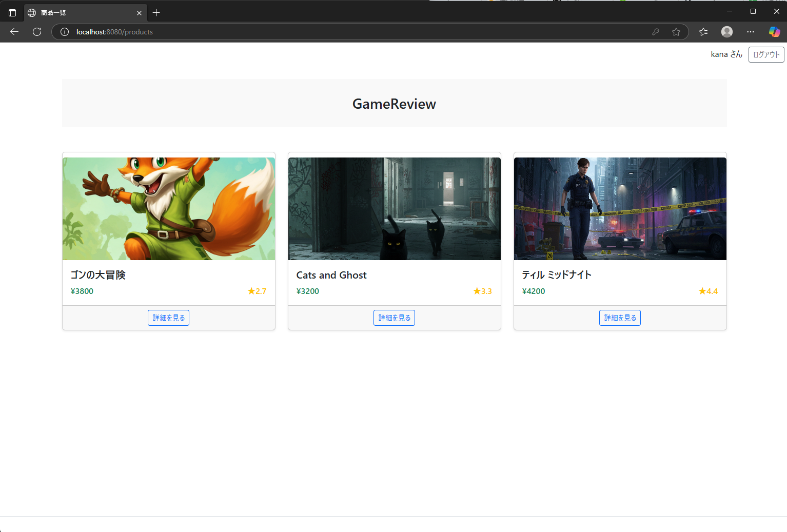

#### 商品詳細画面

- 星の平均点や分布グラフを表示
- 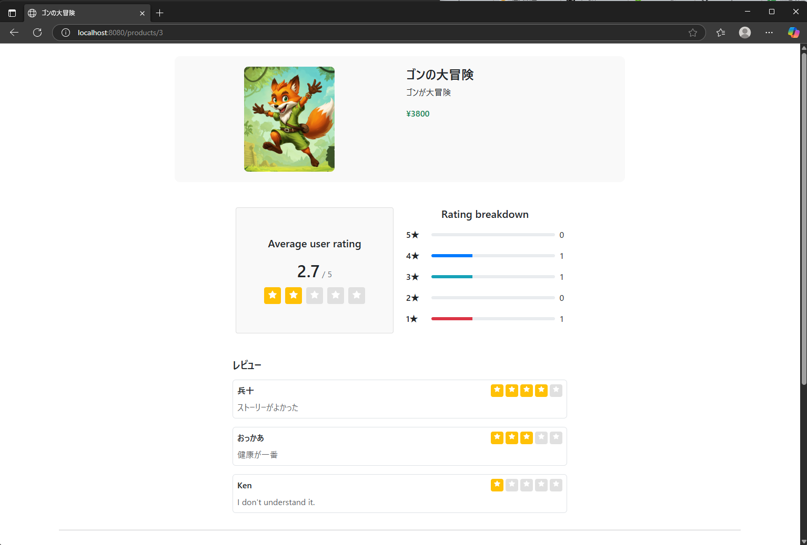

- レビュー投稿フォームが表示される
- 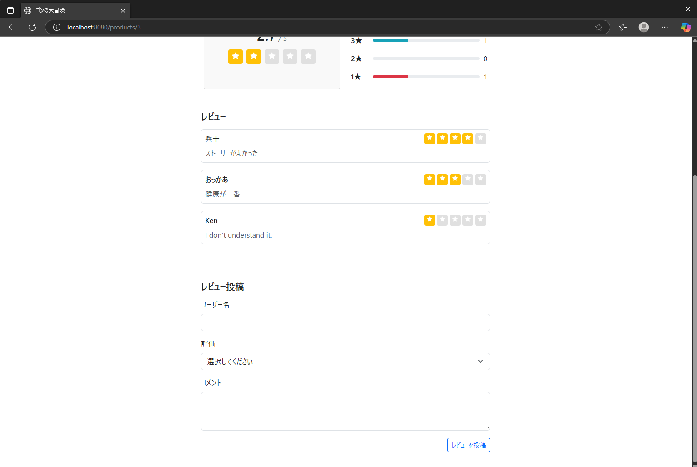

---

### 🚪 未ログインユーザー

#### 商品一覧画面 

- 右上にログインボタンのみ表示
- 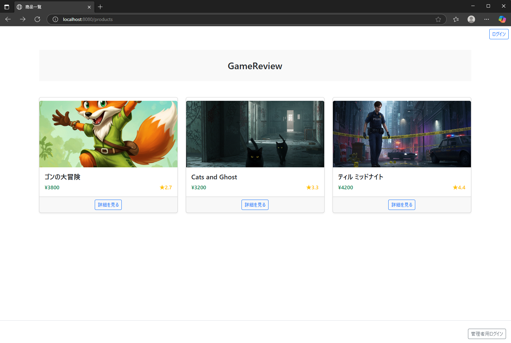

#### 商品詳細画面 

- 「レビュー投稿にはログインが必要です」メッセージ表示
- ログインページへのリンクあり
- 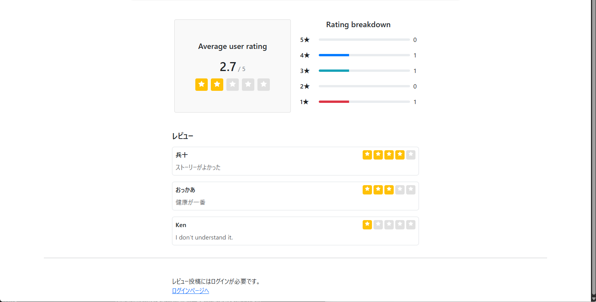

#### ユーザーログイン画面

- ユーザー用ログインページ
- 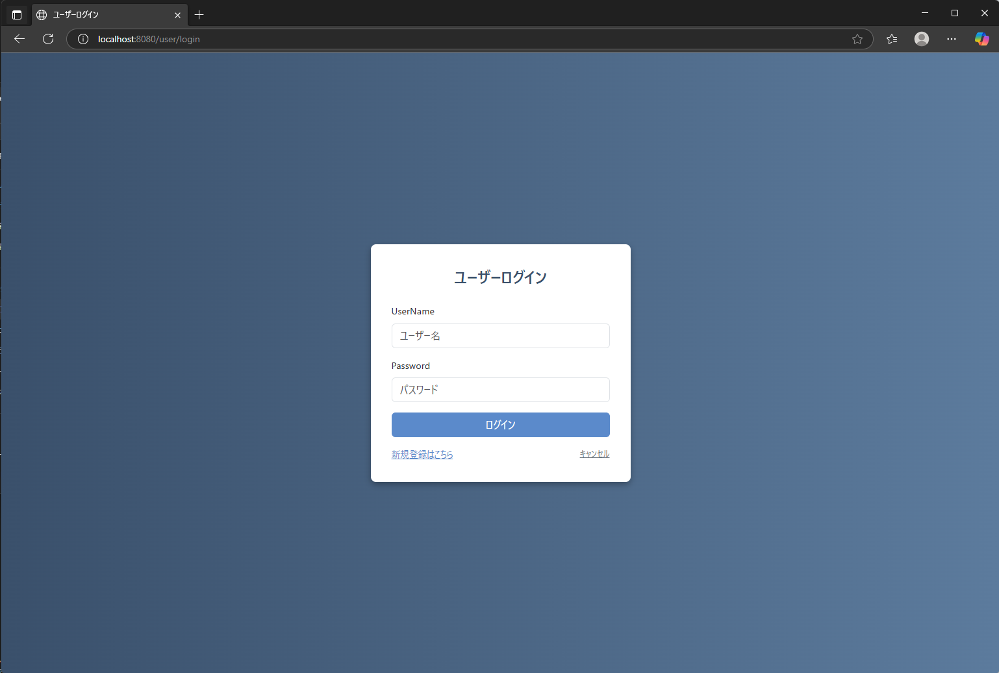

#### ユーザー登録画面 
- ユーザー新規登録フォーム
- 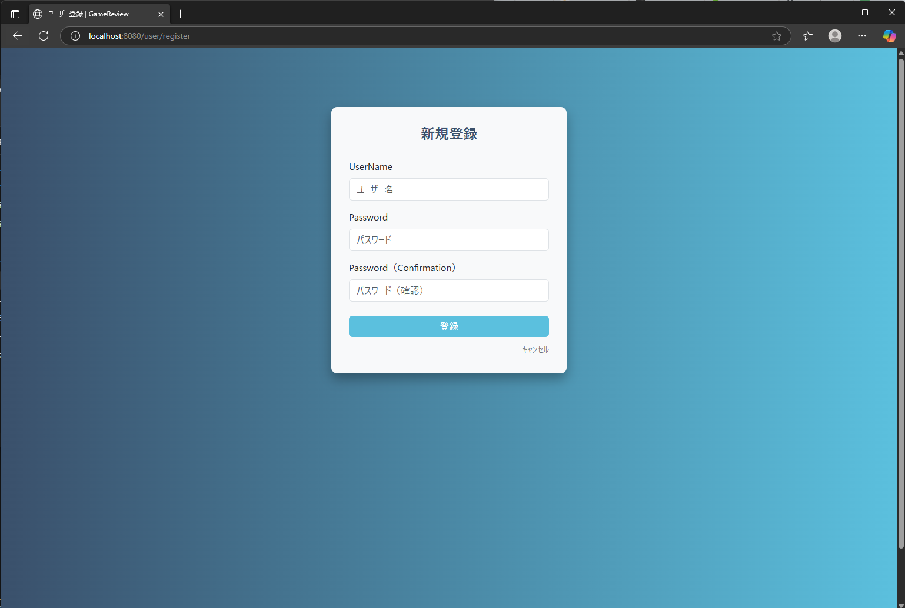

---

## 🗂️ 権限 × 画面対応表

| 画面                             | 管理者 | 一般ユーザー（ログイン済） | 未ログインユーザー |
|----------------------------------|--------|----------------------------|--------------------|
| 商品一覧画面                     | ×      | ○                          | ○                  |
| 商品詳細画面                     | ×      | ○（レビュー投稿可）        | ○（レビュー投稿不可） |
| ユーザーログイン画面             | ×      | ×                          | ○                  |
| ユーザー登録画面                 | ×      | ×                          | ○                  |
| 管理者ログイン画面               | ○      | ×                          | ×                  |
| 管理者用 商品一覧画面            | ○      | ×                          | ×                  |
| 管理者用 商品登録画面            | ○      | ×                          | ×                  |

---

## 💡 工夫点

- Spring Security で管理者とユーザーの認可を分離
- 管理者用とユーザー用でログイン画面を分けて実装
- URLごとにセキュリティチェーンを設定
- Thymeleaf の `sec:authorize` を活用し、ログイン状態に応じて画面表示を切り替え
- Bootstrap を利用し、レスポンシブ対応の見やすい UI を実現
- 商品ごとのレビュー平均点を算出・表示
- 評価分布を可視化（星の色分けやバーグラフ表示）

---

## 🛠 技術スタック

- Java 17
- Spring Boot 3.5.x
- Spring Security 6
- Spring Data JPA
- Thymeleaf
- H2 Database（開発用）
- Bootstrap 5
- Maven

---

## 🚀 今後の展望

- 管理画面に商品編集機能を追加
- 管理者登録の実装
- レビューの編集・削除機能の実装
- 商品画像のアップロード対応
- 例外対応、ログインできない場合の画面表示
